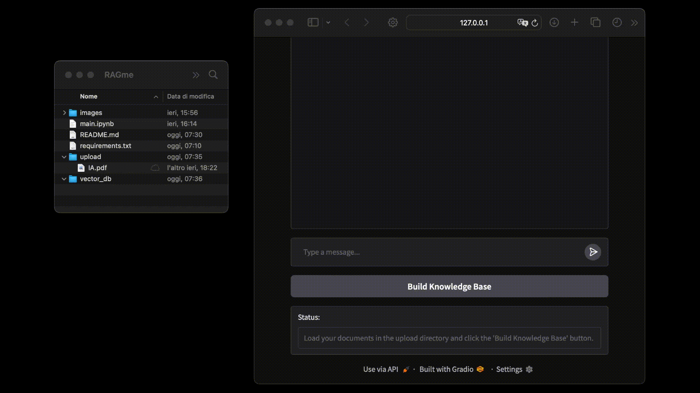

<center><h1> RAGme</h1></center>

<p>RAGme is an innovative platform designed to enhance information retrieval and response generation. Users can upload their knowledge base documents, which are then transformed into a searchable format, enabling the system to efficiently retrieve relevant information in response to user queries.</p>




## 📂 Project structure

```bash
.
├── main.ipynb       # Core application scripts for processing and managing the knowledge base
├── upload/          # Directory for uploading knowledge base documents (.pdf or .txt)
├── vector_db/       # Stores vectorized data for quick retrieval
├── .env             # Environment configuration file
└── requirements.txt # Lists the necessary dependencies for the project
```

## 🛠️ Setup Instructions:

1. Clone the repository:

   ```bash
   git clone https://github.com/GiulioRusso/RAGme.git
   cd RAGme
   ```

2. Install Dependencies: Install the required Python dependencies using:
    ```bash
    pip install -r requirements.txt
    ```

3. Fill the `.env` file with the Environment Variable with your OpenAI key:
    ```bash
    OPENAI_API_KEY=sk-proj-...
    ```

4. Upload Knowledge Base Documents: Place your documents (PDFs or text files) into the `upload` folder. These files will be processed and stored in the vector database created at `vector_db`.

5. Run the `main.ipynb` cells and launch the application!
   ```bash
   jupyter-notebook main.ipynb
   ```

